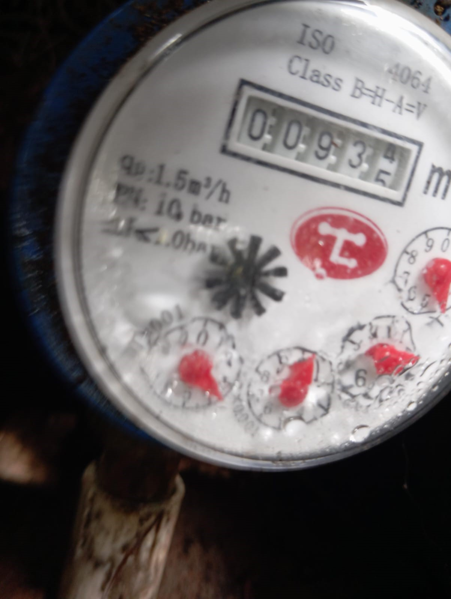

# EXP-01 — Estar en la cárcel
## El libre albedrío suspendido

<div align="center">

[← Volver al índice](../README.md) &nbsp;·&nbsp; [EXP-02 →](./EXP-02.md)

</div>

---

## 🖼️ Imágenes del experimento

<div align="center">

<!-- IMAGEN 1: Foto del circuito montado — reemplaza la URL con tu foto real -->

&nbsp;&nbsp;
<!-- IMAGEN 2: Captura de pantalla del monitor serie o pantalla OLED — reemplaza con tu imagen -->


*Izquierda: circuito montado · Derecha: salida en pantalla*

</div>

---

## 🧪 El experimento

Un servo motor representa la posición del sistema — puede moverse de 0° a 180°.
Un potenciómetro representa la voluntad: cada giro envía un ángulo al servo.
En **MODO LIBRE**, el servo sigue la voluntad en tiempo real.

Cuando el botón activa el **MODO CÁRCEL**, el servo se congela completamente.
La voluntad sigue enviando señales, pero el servo no responde. El contador
`tiempo_carcel` sube segundo a segundo. El sistema documenta cuánto tiempo
el sistema intentó moverse sin poder hacerlo.

---

## 💻 Cómo funciona el código — sin tecnicismos

```cpp
// El servo representa el cuerpo o la capacidad de acción
Servo servo;
int anguloPedido = map(analogRead(A0), 0, 1023, 0, 180);

// En modo libre: la voluntad mueve el servo inmediatamente
if (!bloqueado) {
  servo.write(anguloPedido);
}

// En modo cárcel: el servo ignora la voluntad
// El contador sigue subiendo — documenta el tiempo sin poder actuar
if (bloqueado) {
  tiempo_carcel++;  // ← Sube aunque la voluntad esté al máximo
  // El servo permanece exactamente donde estaba — sin moverse
}
```

**`bloqueado`** — una variable verdadero/falso que decide si el servo obedece.
Cuando es verdadera, el código de movimiento simplemente no se ejecuta.
La voluntad (el potenciómetro) sigue generando un ángulo, pero nadie lo usa.

**`tiempo_carcel`** — el contador que mide cuántos ciclos el sistema lleva
en estado de bloqueo. Cada ciclo del bucle suma 1, independientemente
de si la voluntad está al mínimo o al máximo.

---

## 🌍 El caso de vida real

Una persona en una situación que no puede cambiar de inmediato —
un contrato difícil de romper, una situación legal, una circunstancia
familiar — siente exactamente lo que el servo en modo cárcel:
la voluntad existe y funciona perfectamente, pero el contexto no la deja actuar.

Lo que el experimento hace visible es que **el bloqueo no destruye la voluntad**
— el potenciómetro sigue girando, el ángulo sigue calculándose.
Lo que el código documenta, con `tiempo_carcel`, es cuánto tiempo
transcurrió en ese estado — no si la voluntad estuvo presente.

---

## 🔧 Hardware necesario

| Componente | Cantidad | Función |
|------------|----------|---------|
| Arduino Mega 2560 | 1 | Controlador principal |
| Servo motor SG90 | 1 | Representa la acción posible |
| Potenciómetro 10kΩ | 1 | Representa la voluntad |
| Botón pulsador | 1 | Activa/desactiva el bloqueo |
| LED rojo | 1 | Indica modo cárcel activo |
| Resistencia 220Ω | 1 | Para el LED |

---

## 📁 Archivos de este experimento

| Archivo | Descripción |
|---------|-------------|
| `EXP-01.ino` | Código Arduino completo |
| `EXP-01_circuito.jpg` | Foto del circuito montado |
| `EXP-01_monitor.jpg` | Captura de la salida en pantalla |
| `EXP-01_esquema.pdf` | Esquema de conexiones (próximamente) |

---

<div align="center">

[← Volver al índice](../README.md) &nbsp;·&nbsp; [EXP-02 — La desesperación →](./EXP-02.md)

*"El libre albedrío no desaparece en la cárcel. Solo no puede actuar."*

</div>
